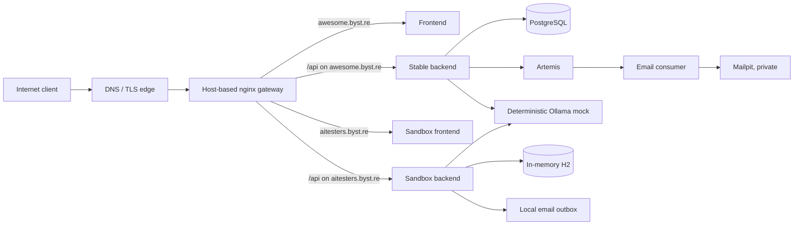

# Production API E2E Discovery

**Created:** 1 October 2026  
**Scope:** black-box API E2E testing of the currently deployed application, with
permission to mutate the dedicated test environment.

## Decision

Use **TypeScript with Playwright Test** as the primary API E2E framework.

This is a good fit because Playwright Test provides a first-class HTTP client
(`APIRequestContext`), fixtures, parallel-worker control, retries, traces,
HTML/JUnit reporting, and browser automation when it is genuinely needed. It
also uses the TypeScript ecosystem the test author already knows. The suite
should be **API-first**; browser tests are a small complement, not the main
test layer.

Do not choose Java/REST Assured merely because the service is written in Java.
That would add a second test ecosystem without testing the deployed system more
realistically. Python/pytest is also viable, but has the same drawback here.

## Public targets

The intended disposable testing target is:

- `https://aitesters.byst.re`

The stable production-like target is:

- `https://awesome.byst.re`

`aitesters.awesome.byst.re` is configured as a gateway alias, but it should not
be used by automation: the normal wildcard certificate covers `*.byst.re`, not
the nested hostname.

Read-only checks performed on 1 October 2026 confirmed:

- `https://aitesters.byst.re/login` returns HTTP 200.
- `https://aitesters.byst.re/actuator/health` reports `UP`.
- `https://awesome.byst.re/actuator/health` returns HTTP 200.
- The sandbox OpenAPI document is OpenAPI 3.1.0 and currently exposes 44 paths
  and 55 operations.

Use the public gateway URLs only. Raw backend, database, broker, mail, and mock
ports are intentionally not public.

## What is actually deployed



Both public sites use the same published frontend image and the same released
backend version family, but their runtime dependencies differ materially:

| Concern | `aitesters.byst.re` | `awesome.byst.re` |
| --- | --- | --- |
| Persistence | H2 in memory | PostgreSQL volume |
| Email path | Application-owned local outbox | Artemis -> consumer -> private Mailpit |
| LLM dependency | Deterministic Ollama mock | Deterministic Ollama mock |
| Seed data | Demo data, including a seeded administrator | Persistent bootstrap/data |
| Reset behaviour | Backend recreation every day at 03:00 server time | No matching daily application reset |
| Correct test role | Full mutation-heavy regression | Minimal, isolated production canary |

The sandbox's H2 profile creates data from scratch at restart and enables the
protected local outbox. The stable environment has PostgreSQL, Artemis, a mail
consumer and a private Mailpit sink. Consequently, a green sandbox suite does
**not** prove the stable site's asynchronous email and PostgreSQL integration.

Both public profiles disable positive SSO. Test password authentication on the
public sites; reserve a positive OIDC/Keycloak journey for the local stack.

## Contract and route observations

The gateway exposes frontend content plus `/api/v1/`, `/swagger-ui/`,
`/v3/api-docs`, `/actuator/health`, the traffic WebSocket, and static images.
It deliberately returns 404 for other actuator endpoints and public Mailpit or
MailHog paths. These are useful negative security tests.

The currently deployed REST contract includes these main areas:

- users: signup, sign-in, refresh, logout, profile, edit/delete, right to be
  forgotten, password reset, MFA, user-scoped email events and chat prompts;
- catalogue and administration: product CRUD and inventory reads/adjustments;
- commerce: cart item lifecycle, orders, cancellation and status changes;
- integrations: email, QR PNG generation, Ollama generation/chat/tool calling,
  traffic diagnostics and a sandbox-only local outbox.

The public OpenAPI document is an excellent input for endpoint and DTO typing,
but it is not a sufficient authorization specification. Derive the expected
authentication and role matrix from the backend security configuration and
confirm uncertain behaviour against the live target. In particular, sandbox
outbox access needs both an authenticated administrator and an additional
outbox-access-key header even if an OpenAPI viewer appears less restrictive.

## Recommended test architecture

Keep the E2E suite in this independent project rather than inside the backend
reference source tree. A practical layout is:

```text
awesome-ai-api/
  playwright.config.ts
  .env.example
  fixtures/
    api.fixture.ts
    auth.fixture.ts
    test-data.fixture.ts
  clients/
    auth.client.ts
    users.client.ts
    products.client.ts
    cart.client.ts
    orders.client.ts
  support/
    ids.ts
    assertions.ts
    cleanup.ts
    sse.ts
  tests/
    smoke/
    api/
      auth/
      users/
      products/
      inventory/
      cart/
      orders/
      email/
      mfa/
      ollama/
    ui/
```

Recommended dependencies:

- `@playwright/test` and `typescript`;
- `zod` for runtime checks on security- or money-critical responses;
- `otplib` for TOTP/MFA flows;
- `eventsource-parser`, or a small local parser, for server-sent event checks;
- optionally `openapi-typescript` for compile-time DTOs generated from
  `/v3/api-docs`.

Use Playwright's request fixture for JSON HTTP calls. For Ollama streaming,
native `fetch` is usually simpler because it exposes the response body stream
directly. Write small domain clients, not browser-style page objects for API
tests.

## Test lanes

### 1. Deployment smoke — both public sites

Run after every deployment and at a short monitoring interval:

1. TLS/gateway route, `/login`, `/v3/api-docs`, `/actuator/health`, and a static
   image are available.
2. A protected endpoint returns `401` without a token.
3. Password login succeeds using configured test credentials.
4. The authenticated user can read `/users/me` and the product catalogue.
5. One deterministic Ollama request produces a well-formed response.
6. Mailpit and non-health actuator routes remain non-public (`404`).

This should stay small: approximately 8–12 fast tests. Existing infrastructure
already probes shallow availability, so these tests should focus on
authentication and useful application behaviour.

### 2. Full sandbox regression — `aitesters.byst.re`

Run the broader mutation suite after deployment and nightly:

- signup -> sign-in -> `/me` -> edit -> deletion/right-to-be-forgotten;
- refresh-token rotation, rejection of an old refresh token, and logout
  revocation;
- customer/admin authorization boundaries, including `401`, `403`, `404`,
  duplicate and validation responses;
- product create/update/delete and inventory adjustment/movement behaviour;
- cart add/update/remove/clear;
- order placement, readback, cancellation, administrative status changes and
  stock effects;
- password reset through the sandbox outbox;
- MFA enrolment, confirmation, MFA login, recovery codes and disable;
- isolation of user-owned chat and tool prompts;
- QR content type and PNG signature;
- Ollama generation, chat, tool calling and SSE final-chunk correctness;
- traffic-log redaction of credentials, tokens and sensitive personal data.

Start with the critical commerce/authentication journey and grow to roughly
35–60 purposeful API tests. Do not aim to duplicate every backend unit test.
The E2E suite is most valuable where deployment, security boundaries, gateway
routing, persistence and integration wiring meet.

### 3. Stable canary — `awesome.byst.re`

Run serially with a single worker, initially after deployment and then on a
regular schedule:

1. Create a uniquely named customer.
2. Sign in and verify the user profile.
3. Read a product, add it to the cart and place an order.
4. Retrieve the order and, where the contract allows it, observe the user's
   own email event.
5. Delete the created user through the intended self-service deletion flow.

This is deliberately narrow. It verifies the real PostgreSQL and asynchronous
email wiring without polluting durable shared data or relying on a seeded admin
account. Do not run broad catalogue mutation, bulk rate-limit tests or shared
fixture accounts in this lane.

### 4. Minimal browser E2E

Use Chromium only at first and keep browser coverage to 3–5 journeys:

- password login;
- browse -> cart -> order;
- one Ollama/chat flow;
- optionally the password reset UI flow.

Cross-browser expansion should wait until the API suite is stable or there is a
specific browser-risk reason to add it.

## Reliability rules

- Generate a run ID plus unique username, email and product name from the test
  ID, timestamp and worker index.
- Never mutate shared seed users or rely on fixed product/order IDs.
- Create data only through public API calls, then clean it in fixture teardown.
- Cleanup must tolerate `404`: the sandbox may have reset while the suite was
  running, and a prior cleanup may already have succeeded.
- Begin with one or two workers on the sandbox. Increase parallelism only after
  each test owns all data it changes.
- Keep rate-limit, load, concurrency and destructive authorization probes in
  separate serial suites so they cannot contaminate normal checks.
- Store administrator credentials and the sandbox outbox key only in CI secret
  storage. Redact `Authorization`, reset links and email content in Playwright
  reports, traces and CI logs.
- Start API regression with zero retries. A later single retry can provide
  diagnostics, but a test that passes only on retry remains a defect to fix.

## CI proposal

| Trigger | Target | Suite |
| --- | --- | --- |
| Pull request | Candidate local stack | Fast compatibility/API checks |
| Immediately after deployment | `aitesters.byst.re` | Full sandbox regression |
| Immediately after deployment | `awesome.byst.re` | Serial business canary |
| Every 15–60 minutes | `awesome.byst.re` | Small authenticated canary |
| Nightly | `aitesters.byst.re` | MFA, reset, streaming, authorization and slower negatives |
| Explicit/manual | Sandbox or local | Rate limits, load, concurrency and aggressive destructive cases |

Avoid the sandbox reset window. The configured schedule is 03:00 in the server
timezone; that timezone is not pinned in this repository, so confirm it before
assigning a nightly CI schedule.

## Delivery order and effort

1. Scaffold the Playwright project, environment configuration, authentication
   fixture, unique-data factory and HTML/JUnit reports.
2. Implement the shared deployment smoke suite.
3. Implement the stable serial canary with robust cleanup.
4. Add sandbox authentication, catalogue, cart and order regressions.
5. Add password reset, MFA, SSE/tool calls, traffic redaction and browser flows.

The first smoke suite is straightforward and should take about one or two days.
A reliable, mutation-safe commerce/authentication suite is moderate work. MFA,
email reset, streaming and CI diagnosis are the harder portions. A realistic
first production-quality release is around one to two working weeks, assuming
the needed test secrets are available.

## Source evidence

This discovery was independently derived on 1 October 2026 from:

- `awesome-localstack/docker-compose.server.yml`;
- `awesome-localstack/nginx/conf.d/app-gateway.conf`;
- `awesome-localstack/ansible/inventory/group_vars/production/main.yml` and the
  AITesters reset service configuration;
- `test-secure-backend/src/main/resources/application-aitesters.yml`;
- backend controller and security source; and
- live read-only checks of the sandbox OpenAPI and health endpoint.
